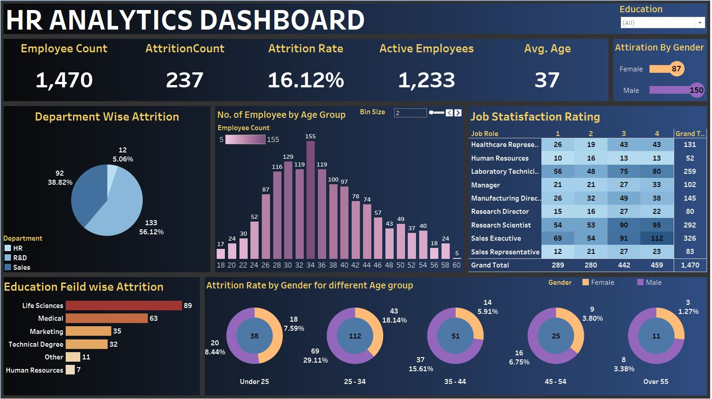

# Hr Analytics Dashboard 2.0
Hi , this is a Hr Analytics Dashboard i created using Tableau hope you like this .
My Hr Analytics Dashboard in Tableau provides a comprehensive visualization of Companys attirations by Age , Education feilds , Gender , Satisfaction rate and many more . It is  user-friendly interface for efficient monitoring and analysis. With intuitive graphs and charts, it offers insights into attrition patterns.    

## Features:
- Made in Tableau
- - Xyz Dataset
- Easy to use and understand.
- Provides an overview of the Attrition Patterns .   
- Allows User to filter data by Educational Feilds.
-
